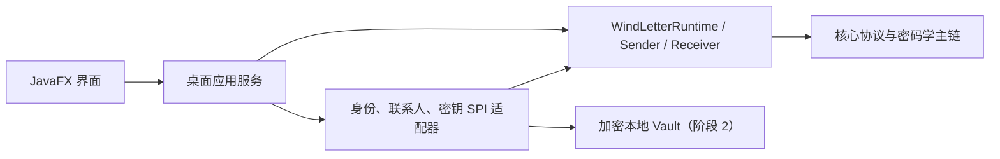

# 風笺 · WindLetter Desktop 整体实现计划

- 文档状态：阶段 1 已完成；阶段 2 已获用户确认并进入前置安全闭环
- 审计日期：2026-07-23（Asia/Shanghai）
- 桌面开发分支：`spike/desktop-v0`
- 核心库基线：`D:\CodingProject\WindLetter` / `spike/demo-v0` / `15677e77f53cc2b6b8b765d124cd3f5cb1023594`

## 1. 当前事实基线

### 1.1 桌面仓库

- `D:\CodingProject\WindLetter-Desktop` 在本次会话开始时是空目录。
- 给定 SSH 地址克隆失败，原因为当前环境没有可用的 GitHub SSH 公钥：`Permission denied (publickey)`。
- 同一仓库可通过 HTTPS 访问，但远端没有任何 refs；克隆结果是无提交、无文件、无远端分支的空仓库。
- 因为不存在可继承的 `HEAD`，已按“不覆盖历史”的原则创建首个未出生分支 `spike/desktop-v0`。
- 当前 `origin` 暂为 `https://github.com/HuanHuanHuanFFF/WindLetter-Desktop.git`。正式开发闭环要求推送，因此阶段 1 开工前必须确认继续使用 HTTPS 凭据，或修复 SSH 公钥后把远端切回给定 SSH 地址。

### 1.2 核心库

- 当前分支为 `spike/demo-v0`，工作区干净，与 `origin/spike/demo-v0` 的 ahead/behind 为 `0/0`。
- 当前 `HEAD` 与提示中的短提交一致：`15677e7`，提交说明为 `feat(armor): add versioned text envelopes`。
- Maven 根坐标为 `com.windletter:windletter:0.1.0-SNAPSHOT`；桌面侧直接使用的门面模块为 `com.windletter:windletter-api:0.1.0-SNAPSHOT`。
- 仓库没有 release tag、`distributionManagement` 或已配置的发布流程；本次对 Maven Central 的检索也未发现该坐标。因此当前不能把它当作已发布、不可变的 Maven 依赖。
- 2026-07-23 使用 JDK `17.0.16` 和 Maven `3.9.9` 重新执行完整 `mvn -q test`：95 个测试套件、928 个测试，0 failure、0 error、0 skipped。

### 1.3 已核对的核心公开能力

桌面端应从 `WindLetterRuntime.sender(...)` 和 `WindLetterRuntime.receiver(...)` 进入真实主链，通过应用侧 SPI 提供密钥与身份，不直接编排协议内部实现。

当前公开 API 已覆盖：

- `PUBLIC` / `OBFUSCATION`；
- `X25519` / `X25519_ML_KEM_768`；
- signed / unsigned；
- `NONE` / `BINARY` / `BASE64_PEM` / `WIND_BASE_1024F_V1`；
- 文本 Armor 精确 Header 自动路由；
- 严格解析、收件人路由、解密、binding、验签和稳定结果状态；
- `SUCCESS`、`NOT_FOR_ME`、`INVALID_MESSAGE` 的不泄密结果形状。

当前精确文本边界为：

```text
-----BEGIN WIND LETTER-----
-----END WIND LETTER-----

-----風笺 起-----
-----風笺 凪-----
```

核心库公开 API 的八种 mode × key profile × signed/unsigned 组合及四种 Armor 已有真实密码学端到端测试。桌面端仍需建立自己的集成测试，证明桌面适配器、输入输出与核心门面确实连通，不能把核心库自身测试冒充桌面应用验证。

### 1.4 已发现的核心 API 边界

- 阶段 1 基线 `15677e7` 中，X25519、ML-KEM-768、Ed25519 私钥 handle 支持生成、导入、使用和销毁，但不支持受控导出私钥材料。
- 核心门面会取得私钥 lease 的所有权并在一次操作后关闭 handle；可持久化实现必须在每次 `open` 时从受保护存储重新导入新的短生命周期 handle。
- 阶段 2 已在核心提交 `da0414cf97cf171a2df00ca56b493eed77dcae5a` 增加受控导出边界并推送：默认 provider 明确为不支持，Bouncy Castle provider 返回调用方负责清理的防御性私钥编码副本。
- 跟进提交 `4a5e9a747148fd05940e7571ff4cc80f014a4127` 使用公开向量锁定三种私钥编码的导入/导出稳定性；完整 96 suites / 933 tests 已通过。
- 桌面端仍需把固定依赖从 `15677e7` 切换到 `4a5e9a7` 并重新执行隔离构建，才可开始 Vault 代码。
- 桌面端始终不得通过反射、复制 provider 实现或另造 ML-KEM 密钥编码绕过核心边界。

## 2. 技术与依赖方案

### 2.1 JavaFX 与 Java 17

- 固定 Java 语言级别和运行基线为 17，使用已核对的 `C:\Users\幻\.jdks\ms-17.0.16`。
- 初始建议固定 JavaFX `21.0.10`：该稳定版本已在 Maven Central；JavaFX 21 官方发布说明明确设计用于 JDK 17 和 JDK 21。
- 使用官方 `org.openjfx:javafx-maven-plugin:0.0.8` 运行应用；Maven 负责下载 Windows 原生 JavaFX 组件。
- 阶段 1 先使用非 JPMS/classpath 结构，避免把尚无 `module-info.java` / `Automatic-Module-Name` 的核心多模块依赖强行送入 `jlink`。入口采用独立 launcher，JavaFX `Application` 不直接作为可执行主类。
- 阶段 5 再以非模块化应用 + 自定义运行时镜像验证 `jpackage`。如届时核心库已提供稳定模块名，可另立验证闭环迁移 JPMS，不在阶段 1 提前扩张。

参考：

- [OpenJFX Maven 使用说明](https://openjfx.io/openjfx-docs/maven)
- [OpenJFX Maven Plugin](https://github.com/openjfx/javafx-maven-plugin)
- [JavaFX 21 发布说明](https://docs.oracle.com/en/java/java-components/javafx/21/release-notes/javafx-release-notes.pdf)
- [JavaFX Controls 21.0.10（Maven Central）](https://repo1.maven.org/maven2/org/openjfx/javafx-controls/21.0.10/)

### 2.2 核心库过渡依赖

当前阶段采用“精确提交校验 + 本地隔离 Maven 安装”，不复制 jar，不把核心源码并入桌面仓库：

1. 桌面仓库保存核心仓库 URL、完整提交 SHA 和 Maven 坐标的基线清单。
2. 准备脚本默认查找相邻的 `D:\CodingProject\WindLetter`，同时允许通过专用参数指定路径。
3. 脚本验证仓库来源、`HEAD` 完整 SHA、工作区干净，并执行核心完整测试。
4. 只有校验通过，才把六个核心模块安装到桌面项目专用且被 Git 忽略的 Maven 本地仓库。
5. 桌面构建和 CI 使用同一专用仓库；构建前门禁重新验证基线标记，避免普通用户全局 `.m2` 中同名 `SNAPSHOT` 污染结果。
6. CI 必须独立 checkout 核心仓库到完整 SHA，不能依赖开发机已有目录。

这个方案的已知限制是 Maven 坐标仍为 `SNAPSHOT`，不可单凭 POM 证明内容不可变。提交 SHA 校验和隔离仓库是过渡门禁。正式发布前应在核心仓库发布带不可变版本号的制品（建议 GitHub Packages 或 Maven Central），桌面端随后删除本地安装过渡路径。

不采用：

- 把核心 jar 提交进桌面仓库；
- 把核心源码复制到桌面模块；
- `systemPath` 指向某台机器的 `target/*.jar`；
- 未固定提交的 JitPack/SNAPSHOT 在线依赖；
- 在桌面端重写协议或密码学以减少依赖。

## 3. 代码责任边界



- JavaFX 层只收集用户意图、展示结果，不解释 wire、AAD、binding 或签名内部细节。
- 应用服务负责流程、输入限制、后台任务、取消和面向用户的通用错误映射。
- SPI 适配器只提供核心所需的公钥解析与短生命周期私钥 lease。
- 核心库独占协议序列化、严格解析、收件人构造/路由、密码学、binding 与验签。
- 日志只能记录非敏感操作阶段、稳定错误类别和随机关联 ID；不得记录 payload、完整消息、密钥、密码、CEK、KEK、shared secret 或底层密码异常细节。

## 4. 分阶段推进

### 阶段 1：工程骨架与真实核心闭环

新增真实能力：应用可启动，并在内存中用真实密钥完成一次 signed WindLetter 的生成、Armor 传递、自动路由、解密和认证展示。

主要交付：

- Maven Wrapper、Java 17/JavaFX 固定版本、可运行 launcher、最小中文窗口；
- 核心基线清单与可复现依赖准备脚本；
- 仅供阶段 1 自检使用的短生命周期内存密钥仓库；
- 一个后台执行的“真实收发自检”流程；
- 核心适配层集成测试、错误边界测试和阶段完成记录。

完成后等待用户确认，再进入阶段 2。

### 阶段 2：身份、联系人与安全密钥存储

新增真实能力：用户可生成、导入、导出、选择和删除身份；可管理联系人公钥；可锁定和解锁本地加密 Vault。

进入条件：

- 先完成并批准私钥持久化威胁模型与格式设计；
- 核心库补齐受控私钥生成/序列化边界，至少能安全持久化并重新导入 X25519、ML-KEM-768、Ed25519；
- 明确版本化公共身份/联系人交换格式，区分产品数据格式与 WindLetter 协议格式。

完成条件包括：错误密码与被篡改 Vault 均返回通用失败；锁定后关闭全部 handle 并清除可控缓冲；密码丢失行为、备份/恢复边界和删除残留风险有用户文档及测试。

### 阶段 3：完整发送界面

新增真实能力：文本/文件 payload、多收件人、两种 mode、两种 key profile、signed/unsigned、三种用户传输格式均可由真实核心 API 生成，并能复制或保存。

完成条件包括：

- 不允许选择与收件人密钥能力不兼容的组合；
- public 模式正确取得发送者 X25519 私钥 lease；obfuscation 模式不传发送者加密身份；
- signed 正确取得 Ed25519 signing lease；
- 文本输出仅对应两种文本 Armor，二进制输出只能保存文件；
- 大任务不阻塞 JavaFX 线程，失败不会留下伪成功输出或敏感临时文件。

### 阶段 4：完整接收界面

新增真实能力：粘贴两种文本 Armor 或导入二进制消息，选择本地身份后完成真实解析、路由、解密和验签，并安全显示原始 payload。

完成条件包括：

- 文本只通过核心精确 Header 自动路由；二进制显式使用 `BINARY`；
- 仅 `DecryptStatus.SUCCESS` 可展示 payload；
- signed valid 显示可信发送者和认证成功；unsigned 明确显示“未签名”，不得暗示身份可信；
- `NOT_FOR_ME` 与 `INVALID_MESSAGE` 有清晰但不形成 oracle 的通用中文提示；
- 未知签名人、错误签名、截断、篡改、错误身份和不支持输入均有真实负向测试。

### 阶段 5：桌面完整性与 Windows 发布

新增真实能力：普通 Windows 用户无需开发环境即可安装、启动、完成收发并卸载。

主要交付：

- 全流程 JavaFX 自动化与人工 Windows 验收；
- Unicode 码点、空文件、较大文件、剪贴板和临时文件安全测试；
- `jpackage` 生成的 Windows 安装包与自带运行时；
- clean-machine 安装/启动/收发/卸载 smoke；
- 使用说明、版本/核心基线信息、升级与备份警告、发布检查单；
- 汇总全部剩余 P2 及影响。

## 5. 阶段 1 准确闭环

### 5.1 选定主流程

阶段 1 UI 自检固定采用：

- `WindMode.PUBLIC`
- `KeyAlgProfile.X25519`
- signed
- `ArmorFormat.BASE64_PEM`
- UTF-8 中文 + 补充平面 Unicode 测试文本
- 单收件人

理由：这个最小组合同时经过发送者 public-mode 身份、收件人加密、签名、标准文本 Armor、精确 Header 路由、解密和发送者认证，比 unsigned 或直接 wire JSON 更能证明桌面主链真实连通。Hybrid、obfuscation 和其他 Armor 留在集成矩阵与后续用户界面阶段，不在最小窗口中提前做配置系统。

### 5.2 可观察结果

自检界面只展示：

- 收发是否成功；
- 输出是否以精确 PEM Header 开始；
- `DecryptStatus`；
- `VerificationStatus`；
- 已认证发送者的非敏感显示名；
- 恢复 payload 与原始 bytes 是否一致；
- 非敏感消息长度和耗时。

不展示或记录私钥、shared secret、CEK、KEK、密码学 provider 堆栈、完整 wire/Armor 或测试 payload 全文。

### 5.3 阶段 1 完成门禁

只有同时满足以下条件才报告阶段完成：

1. 从干净 checkout 执行核心基线准备成功，完整 SHA 与计划一致。
2. 桌面 `mvn test` / `mvn verify` 成功。
3. Java 17 下窗口可真实启动，标题为 `風笺 · WindLetter`。
4. 点击自检后真实输出 PEM，随后只把 Armor 文本交给 `DecryptRequest` 自动检测并成功解密。
5. 结果为 `SUCCESS` + `SIGNED_VALID`，认证发送者非空，payload bytes 完全相等。
6. 篡改/截断 Armor 返回 `INVALID_MESSAGE`，不返回 payload，不打开收件人私钥 lease（如核心边界允许观察）。
7. 使用错误收件人返回 `NOT_FOR_ME`，不误报为成功。
8. 所有私钥 handle 在流程结束或应用退出时关闭；可控 byte buffer 在 finally 中清理。
9. 日志与用户错误经过敏感信息检查。
10. 形成阶段 1 完成报告，区分“代码完成、已接入运行、自动化验证、人工 UI smoke”，列出全部 P2。

### 5.4 阶段 1 不包含

- 不写入任何真实私钥或身份到磁盘；
- 不提供真实用户身份、联系人或 Vault；
- 不提供完整发送/接收配置界面；
- 不提供可分发安装包；
- 不把一次自检称为“桌面端完整可用”。

## 6. 私钥存储边界（阶段 2 已确认）

### 6.1 威胁模型

防护目标：应用数据目录、备份或磁盘被离线复制；普通日志/崩溃信息意外泄漏；Vault 文件被静态篡改。

暂不承诺防护：用户已解锁时的恶意管理员、同会话恶意软件、键盘记录器、进程内存读取、被攻陷的 JVM/核心库或屏幕捕获。Windows SSD 上删除文件也不承诺物理不可恢复。

### 6.2 已确认的加密方向

- 单个版本化 Vault；每个 Vault 使用独立随机 salt。
- 用户密码通过 Argon2id 导出 KEK，参数在目标机器上校准并写入 Vault Header，不硬编码未经测量的成本。
- 使用 AES-256-GCM 对整个版本化 Vault payload 做一次认证加密；每次保存使用唯一随机 nonce；AAD 绑定公开 Header。
- 加密 payload 使用带长度约束的二进制 schema，私钥保持为可清理的 byte buffer，不经过 Base64 或不可变 `String`。
- 密码使用 `char[]`，派生结果、明文私钥 byte[] 和临时缓冲在 finally 中尽力清理。
- 解锁后不长期保留可导出私钥；每次核心操作从解密材料导入新的核心 handle，由 lease 关闭。
- 不在阶段 2 设计门禁前引入 DPAPI。DPAPI 可作为后续“当前 Windows 用户免重复输入”的便利层，但不能替代可迁移备份的用户密码保护。

### 6.3 解锁与恢复

- 应用启动默认锁定；明确输入密码后解锁；支持手动锁定和空闲自动锁定。
- 错误密码、格式错误和认证 tag 失败对用户均显示同一通用错误，详细原因不进入普通日志。
- 备份对象是完整加密 Vault；公开身份/联系人可单独明文导出。
- V0 不设置后门、找回密码或服务端恢复。密码与备份同时丢失即永久丢失私钥；只有公钥不能恢复解密能力。
- 导入/恢复必须先在临时内存中完整校验，再原子替换目标文件；失败保留旧 Vault。

以上方向已由用户确认。精确 schema、输入上限和核心导出契约见
`docs/dev/02-phase-2-identity-contacts-vault-design.md`；实现仍以核心库新增的受控私钥边界为前置条件。

## 7. 自动化测试策略

### 7.1 构建与依赖门禁

- 校验 JDK major、Maven 版本、核心仓库来源、完整 SHA、干净状态。
- 核心完整测试通过后才安装依赖；桌面 CI 从零准备，不使用开发机全局 `SNAPSHOT`。
- Maven Enforcer 固定 Java 17 和依赖收敛；关键插件与依赖均固定明确版本。

### 7.2 应用单元测试

- UI-independent 的输入校验、状态机、文件/文本选择、组合能力判断、错误文案映射。
- 不用 JavaFX 控件承载业务规则，保证大部分测试无需启动图形环境。
- 针对清理/close 的可观察行为写测试，不声称 JVM 能保证清除所有复制过的对象。

### 7.3 真实核心集成测试

- 协议主链不得 mock：使用 `WindLetterRuntime`、真实 Bouncy Castle provider 和真实 SPI adapter。
- 最低矩阵：2 mode × 2 key profile × signed/unsigned × 4 Armor × 文本/二进制 payload。
- 负向矩阵：截断、篡改、错误身份、非收件人、未知联系人、签名失败、Header 错误、二进制格式错误。
- 断言结果语义而非只断言“不抛异常”：失败无 payload，signed/unsigned 认证状态准确，错误不形成内部细节 oracle。

### 7.4 JavaFX 与发布测试

- Controller/ViewModel 测试覆盖界面状态和禁用条件。
- JavaFX 线程上的组件 smoke 验证窗口、关键控件和后台任务回到 UI 线程；正式采用 TestFX/Monocle 前先在 Windows CI 验证稳定性。
- 阶段 5 运行打包后进程 smoke 和 clean-machine 人工验收。未完成真实窗口/安装包验证时不得报告“已接入运行”或“可发布”。

## 8. 当前阻塞与风险

| 等级 | 项目 | 影响 | 处理 |
|---|---|---|---|
| 已解决（阶段 2 核心） | 核心 handle 原先无受控私钥导出/序列化 | 无法安全实现持久化、备份和 Hybrid 身份恢复 | `da0414c` 已实现、`4a5e9a7` 已锁定编码，共 933 tests；桌面固定基线切换尚待完成 |
| P1（当前协作） | GitHub SSH 公钥不可用 | 无法按给定 SSH remote 推送每个闭环 | 用户修复 SSH，或确认使用 HTTPS 凭据推送 |
| P1（依赖） | 核心仅有 `0.1.0-SNAPSHOT`，未发布 | 普通 Maven 坐标可能漂移，CI 不能直接复现 | 先用完整 SHA 校验 + 隔离本地仓库；发布前改为不可变制品 |
| P1（阶段 2，设计已冻结） | 公共身份/联系人交换格式原先未定义 | 导入导出可能互不兼容 | 已在阶段 2 设计文档冻结版本化、严格校验的产品层格式；实现和测试尚待完成 |
| P1（发布） | 核心依赖当前没有稳定 JPMS 模块名 | `jlink` 不能直接把自动模块当正式模块组合 | 阶段 1 走 classpath；阶段 5 验证非模块 `jpackage` 或推动核心模块化 |
| P2 | `windletter-api/README.md` 仍称“contracts only” | 新开发者可能误判真实实现状态 | 在核心库后续文档闭环修正，不阻塞阶段 1 |
| P2 | `DecryptStatus.UNSUPPORTED` 存在但公开 `DecryptResult` 当前禁止该失败形状 | API 认知噪音，桌面错误映射容易误用 | 桌面只按当前可构造结果处理；核心库后续清理/明确契约 |

## 9. 当前推迟的 P2

以下项目不阻塞当前大阶段，但每阶段报告必须重新评估：

- 多语言、主题、复杂动效和高级可访问性完善；
- 自动更新、崩溃上报和遥测；
- DPAPI/Windows Hello 便利解锁、硬件密钥；
- 多设备同步、云备份、密码找回；
- 联系人二维码、文件关联、拖拽和系统分享集成；
- macOS/Linux 安装包与签名；
- 大规模联系人性能优化和数据库化；
- 核心/桌面的完整 JPMS 模块化；
- UI 视觉精修与品牌资产。

P2 不能覆盖协议正确性、密码学、安全认证、私钥保护、真实主流程或可恢复错误；这些问题出现时必须升级为阶段阻塞。

## 10. 阶段记录与 Git 规则

- 每个大阶段在 `docs/dev/` 保存开始基线、关键决策、验证证据、完成报告和 P2。
- 每个完整可验证闭环单独提交；不把依赖准备、核心收发、Vault、发送 UI、接收 UI、打包混成一个大提交。
- 正式开发开始后，闭环只有在测试和约定 smoke 通过后才提交并推送。
- 推送失败不把本地代码称为已交付；必须在阶段报告明确“已提交但未推送”。
- 不自动创建、合并 PR；不覆盖用户改动；每个大阶段完成后停下等待确认。

## 11. 当前下一步

阶段 2 已获用户确认，按以下顺序推进：

1. 已冻结阶段 2 安全与数据格式设计；
2. 已在核心仓库以测试先行方式增加 X25519、ML-KEM-768、Ed25519 受控私钥导出能力；实现 `da0414c` 与编码测试 `4a5e9a7` 均已推送；
3. 当前：固定新的核心提交基线并重新执行可复现依赖准备；
4. 核心边界通过后才实现 Vault、身份、联系人和对应 JavaFX 界面。

在第 3 步完成并建立 Vault 加密写入测试前，桌面端不得写入真实私钥。
